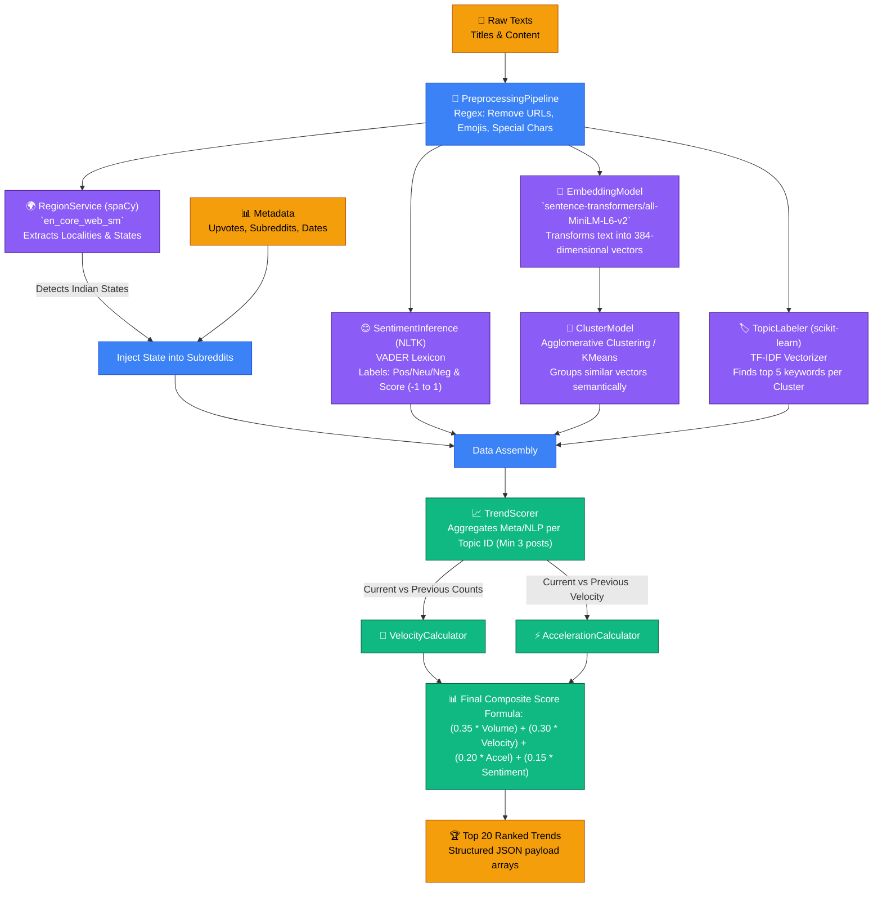

# Trend Intelligence System — ML Engine Pipeline

```mermaid
flowchart TD

classDef process    fill:#3b82f6,stroke:#1d4ed8,color:#fff;
classDef model      fill:#8b5cf6,stroke:#4c1d95,color:#fff;
classDef data       fill:#f59e0b,stroke:#b45309,color:#000;
classDef math       fill:#10b981,stroke:#065f46,color:#fff;

RAW["📝 Raw Texts\nTitles & Content"]:::data
META["📊 Metadata\nUpvotes, Subreddits, Dates"]:::data

RAW --> PREPROC["🧹 PreprocessingPipeline\nRegex: Remove URLs, Emojis, Special Chars"]:::process

PREPROC --> NER["🌍 RegionService (spaCy)\n`en_core_web_sm`\nExtracts Localities & States"]:::model
NER -->|"Detects Indian States"| META_UPDATE["Inject State into Subreddits"]:::process
META --> META_UPDATE
META_UPDATE --> AGG["Data Assembly"]:::process

PREPROC --> VADER["😊 SentimentInference (NLTK)\nVADER Lexicon\nLabels: Pos/Neu/Neg & Score (-1 to 1)"]:::model
VADER --> AGG

PREPROC --> EMBED["🧠 EmbeddingModel\n`sentence-transformers/all-MiniLM-L6-v2`\nTransforms text into 384-dimensional vectors"]:::model
EMBED --> CLUSTER["🧩 ClusterModel\nAgglomerative Clustering / KMeans\nGroups similar vectors semantically"]:::model
CLUSTER --> AGG

PREPROC --> TFIDF["🏷️ TopicLabeler (scikit-learn)\nTF-IDF Vectorizer\nFinds top 5 keywords per Cluster"]:::model
TFIDF --> AGG

AGG --> SCORE["📈 TrendScorer\nAggregates Meta/NLP per Topic ID (Min 3 posts)"]:::math
SCORE -->|Current vs Previous Counts| VEL["🚀 VelocityCalculator"]:::math
SCORE -->|Current vs Previous Velocity| ACC["⚡ AccelerationCalculator"]:::math

VEL & ACC --> FINAL_FORMULA["📊 Final Composite Score Formula: \n(0.35 * Volume) + (0.30 * Velocity) + \n(0.20 * Accel) + (0.15 * Sentiment)"]:::math

FINAL_FORMULA --> OUTPUT["🏆 Top 20 Ranked Trends\nStructured JSON payload arrays"]:::data
```
